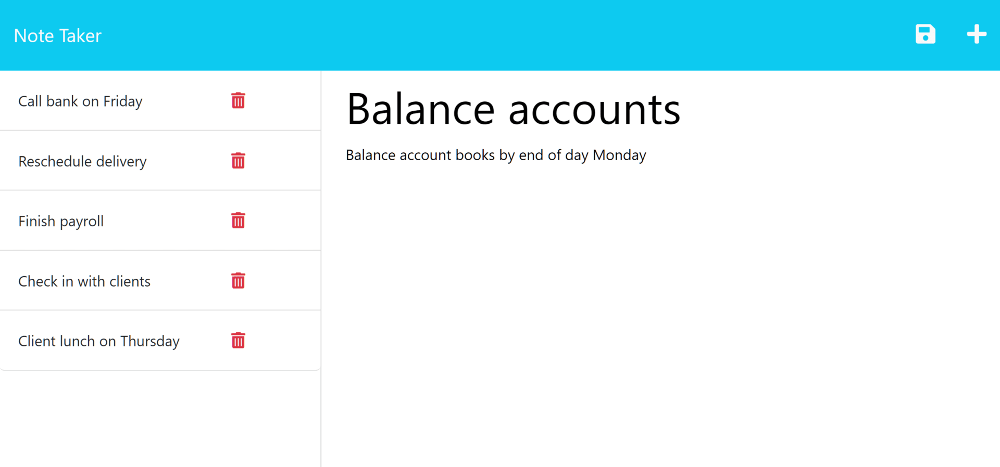

# Rutgers-Module11 (Note Taker)

# Task

Provided with starter code, we were tasked with writing the server site routes for a notes application.

The application’s front end has already been created.

This server side code should have the following routes

- `GET /notes` should return the `notes.html` file
- `GET *` should return the `index.html` file.
- `GET /api/notes` should read the `db.json` file and return all saved notes as JSON.
-  `POST /api/notes` should receive a new note to save on the request body, add it to the `db.json` file, and then return the new note to the client. You'll need to find a way to give each note a unique id when it's saved (look into npm packages that could do this for you).

# Additionally

Host this on GitHub Pages and include a screenshot in this README file as well

[View Project On Heroku ](https://notesapplication1183.herokuapp.com/)

[GitHub Repo](https://github.com/tneiman19/Rutgers-Module11)

